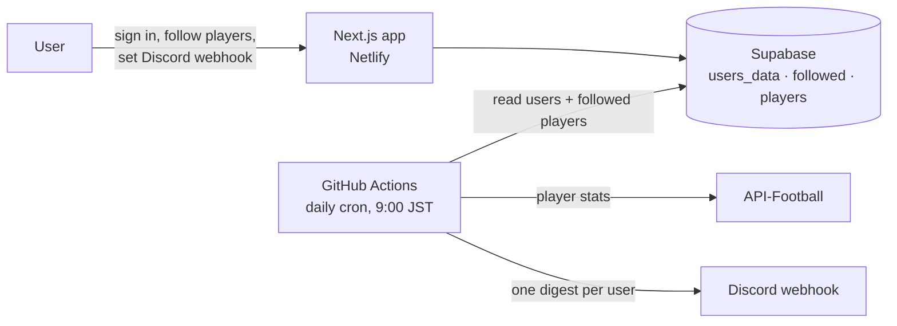

# FootyPulse

Follow football players and get a daily stat digest delivered to Discord.


**Live:** [footypulse.netlify.app](https://footypulse.netlify.app)  ·  **Stack:** Next.js · TypeScript · Supabase (Auth + Postgres) · API-Football · Discord webhooks · GitHub Actions

---

## Why this exists

As a football fan, I wanted one place to compare my favorite players without checking several stats sites every day. The goal was a digest that comes to me, in an app I already have open.

The constraints that shaped the design:

- **Push, not pull.** The value is in not having to check. Stats arrive once a day on their own.
- **Use a channel people already have open.** Discord webhooks need no bot install and no extra app. Each user pastes a webhook URL for their own server or channel.
- **No always-on backend.** The web app handles sign-in and choosing players. The daily work runs as a scheduled job.

## How it works



1. Users sign in with Supabase Auth, search for players, and follow them. Follows are stored in `followed`, player metadata in `players`, and each user's Discord webhook URL in `users_data`.
2. Every day at 9:00 JST, a GitHub Actions workflow runs `script.mjs`.
3. For each user with a webhook set, the job loads their followed players, fetches season stats from API-Football, and sums them across competitions: appearances, goals, assists, penalties, saves, dribbles, cards.
4. The job posts a header message plus one embed per player to that user's webhook.

## Key decisions

| Decision | Why | Tradeoff accepted |
|---|---|---|
| **Scheduled GitHub Actions job, not a server cron** | Free, versioned alongside the code, and no process to keep alive for a once-a-day task. | Timing isn't exact, and scheduled workflows pause after long periods of repo inactivity. |
| **Discord webhooks, not a bot** | Users paste a URL, with no bot permissions or OAuth flow. | Sending only; users can't reply to the bot or interact with it. |
| **Aggregate across competitions** | One number per stat is easier to compare at a glance than a per-league breakdown. | Loses the split between league and cup; per-league stats are a TODO. |
| **Supabase for auth and data** | Auth, Postgres and a JS client in one service, which suits a small app. | The scheduled job depends on Supabase being reachable. |

## Limitations

- **Season rollover is date-based.** The job switches to the new season each July (API-Football keys seasons by their start year). Set `FOOTBALL_SEASON` to override it.
- **Webhook URLs are stored per user.** Anyone holding a webhook URL can post to that channel, so read access to `users_data` must be restricted with row-level security.
- **No retries.** If API-Football or Discord fails for a user, that user's digest is skipped for the day and the error is logged.
- **API quota.** One stats request per followed player per day, so usage grows with users × follows.

## Local development

```bash
git clone https://github.com/luisrrv/footy-pulse
cd footy-pulse
npm install
npm run dev                  # web app on localhost:3000
node script.mjs              # run the daily digest job once
```

Environment variables (`.env`, read by both the app and the job):

```
NEXT_PUBLIC_SUPABASE_URL=
NEXT_PUBLIC_SUPABASE_ANON_KEY=
NEXT_PUBLIC_RAPID_API_KEY=
NEXT_PUBLIC_RAPID_API_HOST=
FOOTBALL_SEASON=            # optional, e.g. 2025
```

Tests (Jest): `npm test`
